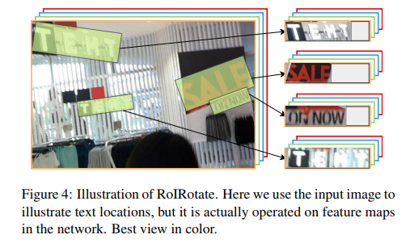
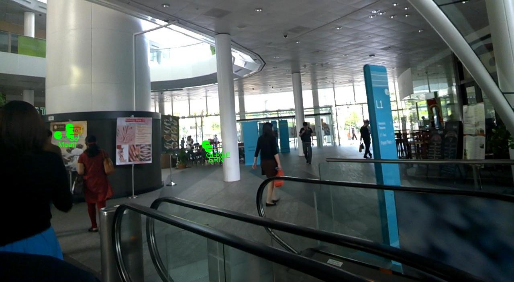
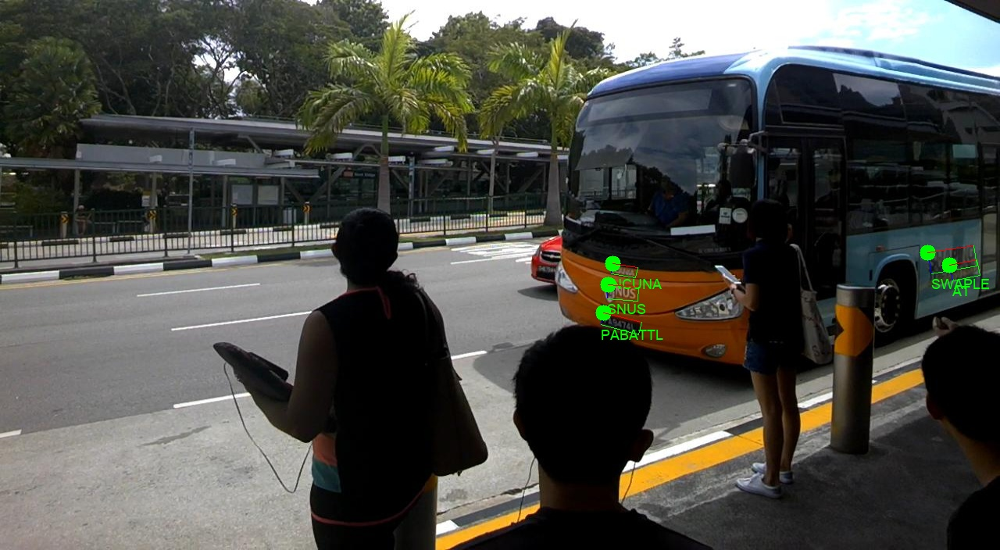
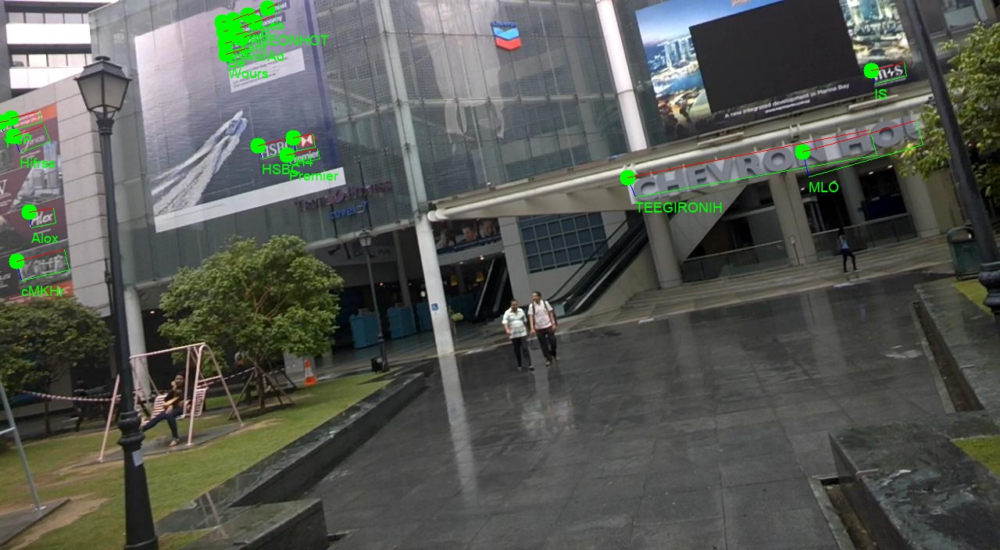
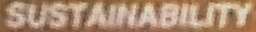

# FOTS.pytorch
This is an unofficial implementation of [FOTS: Fast Oriented Text Spotting with a Unified Network](https://arxiv.org/abs/1801.01671), which is a unified end-to-end trainable Fast Oriented Text Spotting (FOTS) network for simultaneous detection and recognition, sharing computation and visual information among the two complementary tasks. and i mainly borrows from [E2E-MLT](https://arxiv.org/abs/1801.09919), which is an End-to-end text training and recognition network.

## Requirements
  - python3.x with
  - opencv-python
  - pytorch 0.4.1
  - torchvision
  - warp-ctc (https://github.com/SeanNaren/warp-ctc/)
  - gcc6.3 or 7.3 for nms

## Compile extension file
- RoIRotate
for roirotate layer, I've written a pytorch automatic layer

compiling:
```bash
# optional
source activate conda_env
cd $project_path/rroi_align
sh make.sh          # compile
```

- EAST nms
for EAST nms compile, gcc-6.3 works for me. other version i have not test.
any problem can refer to [https://github.com/MichalBusta/E2E-MLT/issues/21](https://github.com/MichalBusta/E2E-MLT/issues/21) or the [argman/EAST](https://github.com/argman/EAST)


# TEST
first download the pretrained model from [baidu](https://pan.baidu.com/s/1So6SRIMUOKL9R7rn9dvC0A),**password:ndav**. which is trained on ICDAR2015. put the model in `weights` folder, then can test on some icdar2015 test samples
```bash
cd $project_path
python test.py
```
some examples:
<table>
    <tr>
        <td ><center>图1 </center></td>
        <td ><center>图2 </center></td>
    </tr>
    <tr>
        <td ><center>图3 </center></td>
        <td ><center>图4 </center></td>
    </tr>
    <tr>
        <td ><center>图5 </center></td>
        <td ><center>图6 </center></td>
    </tr>
</table>


## RoIRotate
RoIRotate applies transformation on oriented feature regions to obtain axis-aligned feature maps.use bilinear interpolation to compute the values of the output
<table>
    <tr>
        <td ><center>图1 </center></td>
        <td ><center>图2 </center></td>
    </tr>
    <tr>
        <td ><center>图3 </center></td>
        <td ><center>图4 </center></td>
    </tr>
    <tr>
        <td ><center>图5 </center></td>
        <td ><center>图6 </center></td>
    </tr>
</table>


# Train
download the ICDAR2015 data and the train_list from [baidu](https://pan.baidu.com/s/1caSNRb9DIHSEvbTtPpKaeA), **password:q1au**
```python
# train_list.txt list the train images path
/home/yangna/deepblue/OCR/data/ICDAR2015/icdar-2015-Ch4/img_546.jpg
/home/yangna/deepblue/OCR/data/ICDAR2015/icdar-2015-Ch4/img_277.jpg
/home/yangna/deepblue/OCR/data/ICDAR2015/icdar-2015-Ch4/img_462.jpg
/home/yangna/deepblue/OCR/data/ICDAR2015/icdar-2015-Ch4/img_237.jpg
```

training:
```bash
python train.py -train_list=$path_to/ICDAR2015.txt
```

# Acknowledgments

 Code borrows from [MichalBusta/E2E-MLT](https://github.com/MichalBusta/E2E-MLT)
